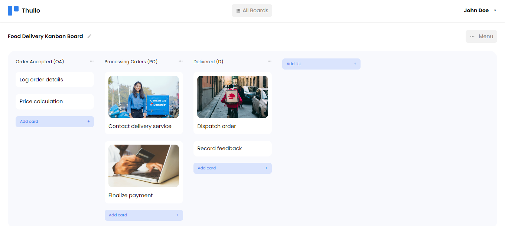

# musica
A simple project management web app that is used to create, read, update and delete boards, lists, and cards. Inspired by Trello.


### Screenshot

<details>
<summary>Screenshot</summary>



</details>


### Built with

- React
- TypeScript
- Semantic HTML5 markup
- Styled Components
- Redux Toolkit for state management
- Node.js for backend


## Project Setup

```sh
npm install
```

### Compile and Hot-Reload for Development

```sh
npm run dev
```

### Compile and Minify for Production

```sh
npm run build
```
